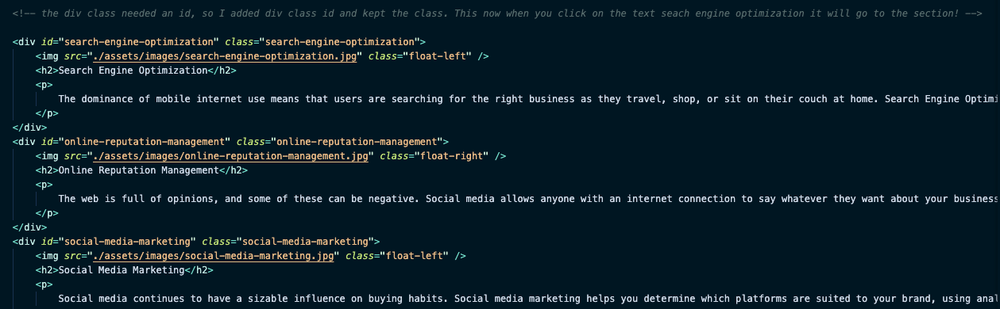
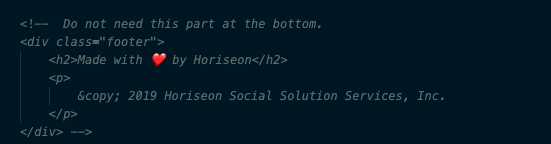
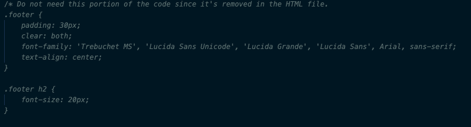

Code Refactor Starter Code.

## Description

Provide a short description explaining the what, why, and how of your project. Use the following questions as a guide:

This assignment was to showcase how to push and pull your code to Github, how to clone your repository to your computer from Github, how to commit and push your code, and how to publish your website. The problem I solved was to clean and refactor the code to make sure things are the same while cleaning the code.
- What did you learn? I learned how to read code and make sure things work accoridngly. I also learned refactoring code is a great way to make sure you know line by line and take out / clean up redundant code. 

## Usage

Examples of what were editied or changed!

1. div class= "search-engine-optimization" There was no ID so once I changed that and the CSS code looked right, I was able able to click on it via the website and it goes down to the section - search-engine-optimization.

2.  
 
        <h2>Made with ❤️️ by Horiseon</h2>
        

            &copy; 2019 Horiseon Social Solution Services, Inc.
        

    
  - This section was not needed so I commented it out

3. .footer {
    padding: 30px;
    clear: both;
    font-family: 'Trebuchet MS', 'Lucida Sans Unicode', 'Lucida Grande', 'Lucida Sans', Arial, sans-serif;
    text-align: center;
}

.footer h2 {
    font-size: 20px;
}
- This section was not neede so I commeneted it out

